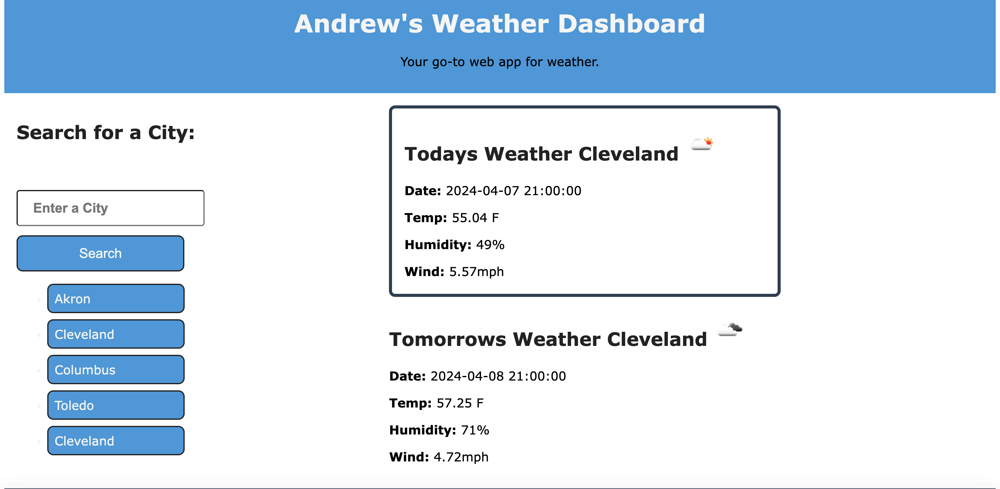

# Weather Dashboard

## Description
This project was created to learn the essence of server-side API along with reinforcing the idea of localStorage persistant data.

## Installation
To install this repo, simply copy the repo and use git clone in your command line along with the copied repo url with your preferred method.

```bash
git clone git@github.com:andrewhamerly/weather-dashboard.git
```

## Usage
This can be used to search for the cities weather and store recent searches in localStorage that can be quickly regenerated with that cities weather for today and tomorrow.

Link to deployed application:
[Weather Dashboard](https://andrewhamerly.github.io/weather-dashboard/)



## Credits
ChatGPT helped in splicing recent search to limit it for the last 8 only.

## License
Source code is licensed under the MIT license.